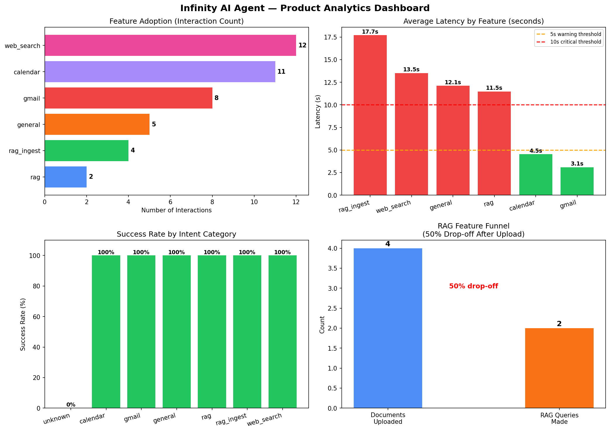

# Product Analytics: Infinity AI Agent

**Analyst:** Sanskar Kosare  
**Stack:** Python, SQLite, FastAPI, pandas, matplotlib

---

## What This Project Does

Instruments and analyzes real usage data from Infinity — a full-stack AI agent 
with RAG, voice, Gmail, Calendar, and web search capabilities — to identify 
drop-off patterns, latency issues, and feature prioritization opportunities.

---

## Key Findings

| Feature | Interactions | Success Rate | Avg Latency |
|---|---|---|---|
| web_search | 12 | 100% | 13.5s ❌ |
| calendar | 11 | 100% | 4.5s ✅ |
| gmail | 8 | 100% | 3.1s ✅ |
| general | 5 | 100% | 12.1s ❌ |
| rag_ingest | 4 | 100% | 17.7s ❌ |
| rag | 2 | 100% | 11.5s ❌ |
| unknown | 7 | 0% | 11.1s ❌ |

---

## Critical Issues Found

- **14.3% silent failure rate** — intent classifier gaps cause 1 in 7 queries to fail with no user feedback
- **4 of 6 features exceed 10s latency threshold** — rag_ingest worst at 17.7s
- **50% RAG drop-off** — users upload documents but never query them

---

## Prioritization

- **P0:** Fix intent classifier fallback — add graceful "didn't understand" response
- **P1:** Cache web search results — reduce 13.5s → target <5s
- **P2:** Add post-upload prompt to close RAG discoverability gap
- **P3:** Stream LLM responses to reduce perceived latency

Full analysis in [memo.md](memo.md)

---

## Repository Structure